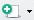
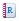
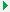
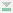
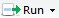
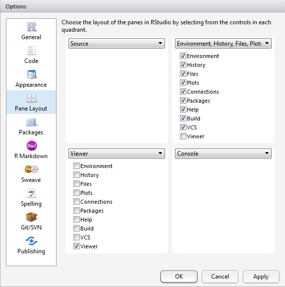

<!-- start formatted header & title -->
 <p style="margin:20px 20px 0 0; float:right; text-align:right;">Tutorial for ArcGIS Pro 2.2 / ArcGIS Desktop 10.6.1<br /> R Scripting Basics</p>
<hr />
<h1 style="text-align: center; font-weight: bold;">R Scripting Basics</h1>
<!-- end formatted header & title -->

# Tutorial Overview

R is an open-source statistical computing language that offers a large suite of data analysis and statistical tools, and is currently the de facto standard for statistical data analysis and visualization for academics and other communities. By completing this tutorial, you will learn basic introductory concepts in R that will enable you to begin working with the R scripting language to execute commands and manage various data. This basic knowledge will give you the pre-requisites needed to manage data efficiently and perform data analysis using the advanced statistical capabilities of R and its many third-party packages. It will also prepare you for follow-up tutorials in this R-ArcGIS series, which introduce you to the use of the R-ArcGIS Bridge that enables you to use ArcGIS datasets within the R programming language, and teach you how to create script tools in ArcGIS.

### Skills

By completing this tutorial, you will become comfortable with the following skills:

* Using R Integrated Development Environments (RStudio Desktop)
* Writing expressions and executing commands in R
* Working with basic objects and data types in R
* Importing and subsetting data in R

### Time required

The following classroom time is required to complete this tutorial:

* 45 - 60 minutes

### Materials Required

* *Technology*:
    * Internet browser (e.g., Mozilla Firefox, Google Chrome, Safari)
    * R Statistical Computing Language (version 3.3.2+)
    * RStudio Desktop (version 1.1.456+)
    * ArcGIS Pro 1.1+ (2.2+ recommended) or ArcGIS Desktop 10.3.1+ (10.6.1+ recommended)
    * R-ArcGIS Bindings (1.0.1.232+ recommended)
 
* *Data*:
    * Data for this tutorial are included as part of the download in the packaged `data` folder.

### Data Sources

* City of Toronto: <br />
  https://www1.toronto.ca/wps/portal/contentonly?vgnextoid=1a66e03bb8d1e310VgnVCM10000071d60f89RCRD
  
* Statistics Canada: <br />
  http://www12.statcan.gc.ca/census-recensement/2016/dp-pd/index-eng.cfm

### Production Date

The Education and Research Group at Esri Canada makes every effort to present accurate and reliable information. The Web sites and URLs used in this tutorial are from sources that were current at the time of production, but are subject to change without notice to Esri Canada.

* Production Date: October 2018

## Background Information

The R user community has seen substantial growth in recent years, and is expected to continue growing due to the increasing popularity of statistical data analysis. You can use R in conjunction with ArcGIS to develop tools that can broaden the functionality of ArcGIS. Before you can create these tools, you need to develop an understanding of basic R usage and syntax. Learning the R language to perform data analysis will greatly extend the possibilities that exist for analyzing both spatial and non-spatial data.

R is an interpreted, interactive language (i.e., it does not need to be compiled like C or Java before being executed). Essentially, this means that each command you provide to R will give you a response as it is executed. You can take that response into account when you provide your next command to R. This allows for a very interactive experience when using R and enables you to experiment easily with the data you are working with.

R is different from many other programming languages, in that it was developed primarily for data analysis and computational statistics. While the language and environment have evolved over the past two decades to incorporate many other capabilities, this initial focus provides R with almost every statistical model and data manipulation technique that you would need for modern data analysis.

By completing this tutorial, you will become familiar with basic R syntax. You will learn how to execute simple commands within R, gain an understanding of several data objects and classes, and learn to import and subset data.

### References and Reading

* R Statistical Computing Language <br />
  http://www.r-project.org/
  
* R For Beginners <br />
  http://cran.r-project.org/doc/contrib/Paradis-rdebuts_en.pdf

* Code School – Try R <br />
  http://tryr.codeschool.com/ 

* Impatient R <br />
  http://www.burns-stat.com/documents/tutorials/impatient-r/

* Applied Spatial Data Analysis with R; Roger S. Bivand, Edzer Pebesma, Virgilio Gómez-Rubio (Springer) <br />
  http://www.asdar-book.org/


# Part A: Getting Started

To prepare for this workshop, you should have successfully completed the *Getting Started* tutorial, which will ensure that you the required software installed and configured to complete this tutorial. You should be familiar with the **R** and **RStudio** software that you have installed and configured. In this tutorial, everything discussed can be completed using the default **RGui** installed with **R**. However, this document is available as an R-Markdown file that you can open and use interactively in **RStudio**. If you choose instead to use **RGui** or another IDE, you can copy/paste code snippets into any R console or R script, or otherwise or adapt the code in another IDE environment.

## Editing/interacting with R scripts:

You can get started by opening the **RStudio** project file, *`r-arcgis-rstudio.Rproj`*, included with the tutorial files. To do so, you may navigate to it in Windows Explorer and double-click on the file, or you can open **RStudio** from the **Windows Start** menu, choose *File* > *Open Project...* from the menu in **RStudio**, and select the *`r-arcgis-rstudio.Rproj`* file. When the project is loaded in the **RStudio** IDE environment, your working directory should be set to the folder location where the *`r-arcgis-rstudio.Rproj`* file is located.

If you prefer to use the default **RGui** application, open it from the **Windows Start* menu. When the interface has loaded, choose the *File* > *Change dir...* menu option, and select the folder that contains the tutorial files.

At this point, in either **RStudio** or **RGui** your current working directory should be pointing to the folder that contains the tutorial files. To confirm this, execute the `getwd()` command in the R console. If the path reported by this is not the folder that contains the tutorial files, then you can set it in the R console by executing `setwd("<path>")`, and supplying the path to the tutorial folder. For example, if the tutorial files were extracted to your hard disk at `D:\r-arcgis-tutorials`, then execute `setwd("D:/r-arcgis-tutorials")` in the R console to set this as the working directory. Confirm again by executing `getwd()` in the R console to ensure that the working directory of the current R session is correct.

*Note: it is recommended that you use forward slash `/` characters when representing paths in R, instead of the Windows default backslash `\` path separator. If using the backslash character, you will need to escape it in text strings with double-backslash characters. For example: `"D:\\r-arcgis-tutorials"`

## Working with R scripts in RGui and RStudio:

Typically, you will edit and save R scripts in plain text files. These are normally saved with the `.R` filename extension. These files can be edited with any simple text editor, but they can also be interactively executed while open in the **RGui** or **RStudio** interfaces.

1. To start a new R script:
    * In **RGui**,  choose *File* > *New Script...* from the main menu
    * In **RStudio**, click the *Create a New File*  dropdown button and select *R Script*
    
2. In either **RGui** or **RStudio**, you can begin editing the script by typing commands in the editor window. For example, type the following command:

`plot(cars)`

3. Place the cursor on the line with the `plot` command (do not highlight any text) and press ***CTRL+R*** (in **RGui**) or ***CTRL+Enter*** (in **RStudio**). The current line will be sent to the R console and executed as if you had typed it in directly. You will notice in this example a scatterplot is also generated from the cars sample dataset (included with the base R software). In **RGui**, the plot appears in a separate window. In **RStudio**, it captured and displayed in the *Plots* tab.

The same steps can be used to execute a highlighted range of code. For example:

1.	Add a second line in the R source code with the following command:

`help(cars)`

2.	Now click and drag the cursor in the editor window until both lines with the `plot` and `help` commands are fully highlighted, and then press ***CTRL+R*** (in **RGui**) or ***CTRL+Enter*** (in **RStudio**). You will see both commands are executed in the console. In addition to displaying the plot, the help documentation for the sample dataset will be displayed, either in a default Web browser window from **RGui**, or in the *Help* tab in **RStudio**.

## Working with R Notebooks in RStudio:

**RStudio** features the ability to compose *R Notebooks*, which are simple text documents using *R Markdown* syntax. Within the markdown text, 'chunks' of R code can be inserted within the text. These blocks of R code start with three backtick characters and the letter 'r' (\`\`\`\{r\}) on a separate line, followed by one or more lines of R code, and are terminated with three more backtick characters (\`\`\`) on a separate line. The surrounding markdown text enables publication-quality text to be composed, while the embedded 'chunks' of R code can be executed interactively in **RStudio** like a regular R script.

To start a new markdown document in RStudio:

1. Click the new file button  and select the  *R Notebook* menu option. A new R-Markdown document will be created with 'html_notebook' specified in the header as the default output format.
2. Save the document as *`sample.Rmd`* (press ***CTRL+S***) in your current working directory
3. Click the  *Preview* button on the toolbar at the top of the source editor. A formatted preview of the document is displayed with the sample code chunk displayed within the text.

You can write and interact with R code inside the blocks as if they were regular R scripts in **RStudio** (i.e., by placing a cursor on a line, or highlighting a range of text, and pressing ***CTRL+Enter***). You can also run the current block by clicking the  button near the top-right, or by placing the cursor in it and pressing ***CTRL+Shift+Enter***.

If you are partway through a document with multiple chunks, you can press the  button near the top-right to run all previous code chunks, after which you can resume from the current chunk. This is helpful if the current chunk is dependent on results from code executed in previous chunks.

In the *`sample.Rmd`* file that you just created, try running the sample chunk included in it with the `plot(cars)` command. You will see the plot generated for the cars dataset, but instead of being displayed in a separate tab in **RStudio**, it is embedded inline within the document, immediately below the code chunk. The plot will also appear embedded in the HTML generated from the Markdown when you click the preview button.

Add a new chunk to the *`sample.Rmd`* file to preview the cars dataset:

1. Place the cursor on a new/empty line in the source editor window, and press ***CTRL+ALT+I*** or choose *Code* > *Insert Chunk* from the main menu.
2. Enter the following code on a single line: `cars`
3. Run the chunk.

The result of this command is to simply output the sample `cars` dataset directly to the R console. However, within the R Markdown, this output is captured and presented as a formatted table view. Compare this to the same command if executed directly in the console:

1. Place the cursor in the R console
2. Type `cars` (or press the up arrow to restore the line executed previously)
3. Press ***Enter*** to execute the code.

The result of this presents the same data, but displayed as plain text in the R console window. This comparison exemplifies the utility of using R Markdown files for composing notebooks to combine print-quality formatted text (derived from the Markdown syntax) with embedded source code and outputs displayed inline within the document.

When working with a larger R Markdown file in **RStudio**, it is also possible to run the entire file from beginning to end by clicking the  button, and choosing *Restart R and Run All Chunks*. This is useful to quickly run all code so that you can display the final results in the R Notebook preview. It can also help you identify any errors or missing dependencies between multiple chunks of code before sharing your workbooks.

If you want to start with a fresh R session, and step through all of the code chunks interactively, you can reset and start from the beginning by instead choosing *Restart R and Clear Output* from the same  button. 

More details about working with R Notebooks in RStudio can be found at [http://rmarkdown.rstudio.com/r_notebooks.html](http://rmarkdown.rstudio.com/r_notebooks.html). The R Markdown syntax used by  **RStudio** is based on *Pandoc* ([https://pandoc.org/](https://pandoc.org/)). Details about the syntax for writing this style of Markdown in RStudio can be found online at [http://rmarkdown.rstudio.com/authoring_pandoc_markdown.html](http://rmarkdown.rstudio.com/authoring_pandoc_markdown.html)

## Working with the R Markdown for this tutorial in RStudio:

To work with the source for this document:

1. Open the *`r-arcgis-rstudio.Rproj`* file in **RStudio**
2. You will want to settle on a pane layout for working in **RStudio**. For the purposes of this tutorial, the following layout is suggested:
    a. From the main menu, open *Tools* > *Global Options...*
    b. Select the *Pane Layout* options - here you see options for choosing where to position windows and tabs in four quadrants of the screen.
    c. Choose *Source* in the top-left, *Console* in the bottom-right, and check all boxes for tabs to appear in the top-right panel, leaving only the *Viewer* tab in the bottom left. The *Viewer* tab will not be used throughout this tutorial, so you will be able to collapse that panel to maximize the screen space used to view code in the *Source* panel:

<p style="text-align:center;"></p>

3. Open the *File* tab in the top-right panel (based on the layout options chosen above), and click on the file named *`2-R-Scripting-Basics.Rmd`*. The R-Markdown source code for this document will open in the *Source* editor window in the top-left.

4. In the top-right corner of the source editor, you may click the  maximize icon to toggle the maximized state of the panel, and use as much screen space as possible to display the document's source code.

***Note:*** The remainder of this document is written with the expectation that you are working with the R Markdown file in **RStudio**. If not, you may manually copy R commands enclosed in the \`\`\`\{r\} code blocks into any R console, provided that your current working directory (reported by `getwd()`) corresponds with the location where the tutorial files are located.

Before proceeding to interactively run code in the rest of the R Markdown document, select *Restart R and Clear Output* from the  menu, and then run the following block to set some options in the R environment to help with the display of outputs in the resulting R Notebook:

```{r}
options(useFancyQuotes = FALSE)
```

# Part B: Working with packages and sourcing code:

One of the most notable strengths of R is it's vast resource of packages that add functionality for manipulating and analyzing datasets. One of the first things you are likely to do with R is install some packages that give you the tools that you require to do your analysis. As you continue developing code in R, you will also find it useful to build R scripts that bundle related code and functions you can be shared and re-used by multiple R programs.

### Using from the Comprehensive R Archive Network (CRAN)

Any packages from the [**CRAN** repository](https://cran.r-project.org) that you require can be installed easily using the menu options within RGui or RStudio, or from an R console or script using the `install.packages(<packagenames>)` method...for example, to install the `dplyr` package:

```{r eval=FALSE}
install.packages("dplyr")
```

You can install mutiple packages at once by providing a string vector of package names:

```{r eval=FALSE}
install.packages(c("dplyr", "sp", "maptools"))
```

Once a package is installed, you can load it by executing `library(<packagename>)`. For example, if the `dplyr` package is already installed, it can be loaded in the current R session as follows:

```{r eval=FALSE}
library(dplyr)
```

### Loading the ArcGIS Binding package

When the **R-ArcGIS** bridge has been installed, it will make an `arcgisbinding` package available to be loaded into an R session. The installation details are covered in the *Getting Started* tutorial. If you have not installed it yet, you may refer to video demonstrations published online by Esri that step you through the installation process for different versions of **ArcGIS Pro** or **ArcMap**:

- **ArcGIS Pro 2.0+** [https://geonet.esri.com/videos/4136-installing-the-r-arcgis-bridge-for-arcgis-pro-20](https://geonet.esri.com/videos/4136-installing-the-r-arcgis-bridge-for-arcgis-pro-20)
- **ArcGIS Pro 1.1-1.4.1** [https://geonet.esri.com/videos/4135-installing-the-r-arcgis-bridge-for-arcgis-pro-11-141](https://geonet.esri.com/videos/4135-installing-the-r-arcgis-bridge-for-arcgis-pro-11-141)
- **ArcMap 10.3.1+**[https://geonet.esri.com/videos/4134-installing-the-r-arcgis-bridge-for-arcmap-1031](https://geonet.esri.com/videos/4134-installing-the-r-arcgis-bridge-for-arcmap-1031)

Once the **R-ArcGIS** bridge is installed, you can load the `arcgisbinding` package like any other package from an R console. When the package is loaded initially in a given R session, you will be prompted to call `arc.check_product()` in order to bind to the **ArcGIS** software you have installed. In 64-bit R, this will bind to the **ArcGIS Pro** environment. When using 32-bit R, it will bind to **ArcGIS Desktop** (ArcMap) environment:

```{r}
library(arcgisbinding)
arc.check_product()
```

### Getting Help

You can get detailed help documentation for functions, classes and language constructs in the base R system, as well as any third party packages loaded in an R session. This is done by entering `help(<topic>)` into the console, or entering the module or function name into the console prefixed with a question mark `?`. This opens the corresponding help web page. A keyword search can also be executed using `help.search("<text>")`, or by prefixing the search term with a double-question mark `??`. The full help start page for R and all locally installed packages can be opened in a new web page by executing `help.start()`. Try executing the following commands individually (in **RStudio**, place the cursor on a line and press ***CTRL+Enter***) to see the help documentation displayed for each:

```{r eval=FALSE}
help()                 # Default documentation for help()
help.start()           # Main help for R and all installed packages.
help(mean)             # Help for the mean() function (same as ?mean)
?data.frame            # Help for the data.frame() function
help.search("arcgis")  # Keyword search for "arcgis"
??"arcgis"             # Shorthand for help.search("arcgis")

# Enclose names with special characters in quotes
?"arc.dataset-class"

# Use a namespace prefix to access methods from a specific package instead of the current session's default (e.g., if one package masks methods from another)
?dplyr::filter

# For example, the stats::filter() is masked by dplyr::filter() when dplyr is loaded in an R session
?stats::filter
```

## Sourcing R code

If you have code in an R script file that you would like to include in another script or console session, you can use the `source("path/to/script.R")` command. This will execute the code in the current R session. This is particularly useful, for example, to load re-usable functions, or to use a script to setup pre-configured datasets.

Open the `R/helper-functions.R` file included with this tutorial and review its content (in **RStudio**, click the `R` folder in the *Files* tab, then click the `helper-functions.R` file). You will see code that defines two sample functions. The `load_pkgs()` function accepts a string vector of one or more  package names, it will check for missing packages and attempt to install them, and then loads each package (using `require()` instead of `library()`). It will also handle a special case where the package name is `"arcgisbinding"` (which cannot be installed from **CRAN**). It will instead call the `load_arcgisbinding()` function. For convenience, the `load_arcgisbinding()` function will load the `arcgisbinding` package and upon success it will automatically call the `arc.check_product()` to bind to ArcGIS software.

To make use of these functions in any console or script, you can source this script and then call the `load_pkgs()` method with one or more package names specified in a vector of character strings:

```{r}
source("R/helper-functions.R")
load_pkgs(c("arcgisbinding", "dplyr", "sp", "maptools"))
```

# Part C: Working with Data in R

R is an object-oriented language. Data, functions, etc. are all stored in active memory as objects that can be assigned to variable names in R code. While you will likely work with a variety of different objects and data types as you develop programs in the R language, it is important to understand the core data types and how to work with them in R code.

## Basic objects and data types

There are several object types that are provided by the core R language. Each object type can store different data types. Some can only store one type in a given instance, while others allow mixed data types. Additional object classes may also be introduced by third-party packages (e.g., shape and dataset classes introduced by the `arcgisbinding` package).

| Object Type      | Data Types                             |  Mutliple data types allowed? |
| ---------------- |:----------------------------------------------------------------:| ---:|
| vector           | numeric, character, complex, or logical                          | No  |
| factor           | numeric, or character                                            | No  |
| array            | numeric, character, complex, or logical                          | No  |
| matrix           | numeric, character, complex, or logical                          | No  |
| data frame       | numeric, character, complex, or logical                          | Yes |
| ts (time series) | numeric, character, complex, or logical                          | No  |
| list             | numeric, character, complex, logical, function, expression, ...  | Yes |

Vector and data frame objects are typically used for storing and working with data. List objects are useful in R programming, as they allow storage of multiple objects, and can reference its elements by name (e.g., similar to dictionary objects in Python). For the purposes of this tutorial series, we will focus on the more commonly used vector, data frame, and list object types. For more details on any of these object types in the R language, use the `help(object_type)` command.

### Creating data objects

Object are created using the assignment operator `<-` to assign values to a variable name (the `=` operator works too in most cases). The vector object type is the most basic/common object type. By assigning a simple numeric value to a variable, you are effectively creating a numeric vector with one data point:

```{r}
n <- 5    # Assign a number to a variable 'n'
n         # Print the contents of the 'n' variable in the console
class(n)  # Report the class of 'n'
```

***Note***: R is case-sensitive, so ensure that you use the same case when declaring/typing variable names. Variable names in R typically are alphanumeric characters, and may also contain '`.`' characters  ('`.`' is often used in R code as a substitute for spaces, and has no other functional meaning like it does in many other programming languages).

If you want to interpret the numeric value assigned to `n` above specifically as an *integer* data type (which is a subset of *numeric*), you can either use the `as.integer()` function to cast a number (or vector of numbers) as an integer data type, or you can append an uppercase `L` after integer values when assigning them:

```{r}
i <- 5L   # Assign an integer to a variable 'i'
i         # Print the contents of the 'i' variable in the console
class(i)  # Report the class of 'i' 
```

Recall from the table of object types that vectors can only contain one 'mode' or data type. If you mix values when creating a vector, the vector will default a data type that can represent all values. For example:

```{r}
# Mixing integers with numeric values results in a numeric vector
class(c(5L, 5))

# Mixing characters with other data types results in a character vector
class(c("5", 5L, 5))
```

*TIP*: in **RStudio**, the ***ALT+-*** shortcut will insert the `<-` assignment operator

To create a vector with multiple values, use the *combine values* function `c()`, and supply each element as a separate argument. For example, create a vector of numeric values that contains the first twelve values in the Fibonacci sequence:

```{r eval=-1}
?c
fib <- c(0, 1, 1, 2, 3, 5, 8, 13, 21, 34, 55, 89)
class(fib)  # Return the type of vector (numeric)
str(fib)    # str() will describe the structure of the fib fariable
fib         # Print the vector data in the console
```

Tabular data can be stored as data frames. A data frame is essentially a series of vectors (i.e., columns), each containing an equal number of values. A data frame can be created from one or more for vectors. For example, to represent the scenario associated with the Fibonacci series, let's create a vector containing the names of months, which will correspond to the number of pairs in the population of rabbits described by the Fibonacci series:

```{r}
month <- c("jan", "feb", "mar", "apr", "may", "jun", "jul", "aug", "sep", "oct", "nov", "dec")
pairs <- data.frame(month, fib, stringsAsFactors = FALSE)
class(pairs)
pairs
```

### Basic operators

Typical mathematical and relational operators are available in the base R language. You can get a summary of some of the most common operators by executing `help("Arithmetic")` or `help("Comparison")`. When working with vectors, you can operate with a vector with one or more values against either another vector of equal lenght, or a single-value vector. In addition to these, the colon operator (`help(":")`) is a convenient means to generate a regular sequence of integer values. For example:

```{r}
# add two single-value vectors
1+1

# add a single value to all values in the fib vector
fib+1  

# add values from a series of 1 through 12 to each corresponding value in fib
fib + c(1:12)    

# this will not work with two multi-value vectors of unequal length
fib + c(1:15)

# the operation will 'wrap around' if the longer vector is an even multiple of the shorter
fib + c(1:36)

# fib values squared
fib * fib

# get TRUE/FALSE logical values where fib values are greater than 10
fib > 10

# get TRUE/FALSE logical values where fib values are greater their position in the sequence
fib > c(1:12)
```

## Working with vectors and data frames

R has a variety of approaches using basic syntax for accessing elements in a vector or data frame. As you learn to work with these, you will be able to efficiently interact with and manuipulate datasets in the R language.

### Accessing data in Vectors

Selecting elements from a vector is done by providing a number or range in square brackets after the name of the variable. For example, using the vector of Fibonacci numbers we created earlier:

```{r}
fib[10]   # Return the 10th number from the series
fib[1:6]  # Return the first 6 numbers from the series
```

Create some logical (i.e., boolean) vectors using conditional operators:

```{r}
gtfive <- fib > 5          # Identify which numbers are greater than 5
modfive <- fib %% 5 == 0   # Identify which numbers are divisible by 5
```

These logical vectors can in turn be used as an index to identify elements in the vector that match a certain condition. To select a subset of elements from the series using a logical vector, provide the logical vector within the square brackets of the vector with the values you want to choose:

```{r}
fib[gtfive]         # Get the numbers greater than 5 
fib[modfive]        # Get the numbers divisible by 5
fib[fib %% 5 == 0]  # Conditions can be used inline too
```

### Accessing data in Data frame objects

To select values from a data frame, you need to provide two parameters in the square brackets, separated by a comma. The first parameter identifies the rows you want (blank returns all rows), and the second identifies the columns to be returned (blank returns all columns). You can use a list of numeric indexes (starting at 1), or logical vectors. For the columns, you can also specify column names using a character vector:

```{r}
# Both columns where fib > 5
pairs[gtfive, ]

# First column where fib %% 5 == 0
pairs[fib %% 5 == 0, 1]

# The fib column where month contains 'n'
pairs[grepl('n', pairs$month), c('fib')]

# All rows for a range of columns
pairs[, 1:2]

# Negative indexes will drop rows
pairs[-1:-3, ]

# Negative indexes can also drop columns
pairs[-11:-12, -2]
```

You can also reference columns (i.e., vectors) in the data frame directly. For example, the 'fib' or 'month' columns can be accessed as a regular numeric or character vectors using the following syntax:

```{r}
# Return the 2nd column as a vector, using double-square brackets:
pairs[[2]]

# Column names can be used instead of numeric indexes:
pairs[["month"]]

# A column can also be selected by name using the $ operator:
pairs$fib
```

***Note***: in RStudio, as you work through the R Markdown file, all of the lines or blocks of code that you execute from the chunks of code are being executed in the R session displayed in the Console panel. If you place your cursor in the console, you can execute any code and work with the variables you have created so far. You may also use the up/down arrow keys to access any previously executed commands.

# Exercise 1

Now that you are able to work with basic vectors, data frames, and operators in the R language, try interacting with the variables that have been created. For example, you can calculate the next value in the Fibonacci series that would represent the number of pairs of rabbits in the population at the end of the year. This value is the sum of the last two months in the series).

a. Obtain this value by calculating the sum of last two elements of the `fib` variable.
b. Try to do the same by accessing the same values from the `fib` column in the `pairs` data frame, and the month names to select the desired rows, instead of numerical indexes.
c. *Bonus:* use the `sum()` function in the base R language to calculate this value instead of a simple `+` arithmetic operator.

## Loading/interacting with datasets:

The base R system comes with a variety of methods for reading and writing data sets in different formats. Additional packgaes expose the ability to connect to databases, or read/write simple spatial formats. The  R-ArcGIS `arcgisbinding` package introduces the ability to natively read/write ArcGIS datasets (File Geodatabase feature classes and tables, shapefiles, feature layers, etc.).

### Read CSV data

The following is an example of how to read a CSV file containing income data aggregated at the census subdivision level. These sample data are derived from the 2016 census data published by Statistics Canada. Passing `stringsAsFactors = FALSE` as an argument ensures that columns in the CSV storing text data are loaded as simple character vectors (instead of being converted to a factor data type).

```{r eval=-1}
?read.csv
census_csd <- read.csv('data/census/income2016csd.csv', stringsAsFactors = FALSE)
```

You can use the `str()` function to get a view of the data frame's structure, or the `View()` method to display a table view of data frame's contents. 

```{r eval=-2}
str(census_csd)   # Report the data structure of the census_csd variable 
View(census_csd)  # Open a window (or tab in RStudio) showing the tabular data
```

You can also inspect the structure and contents of the data frame from the *Environment* tab in RStudio, where you can view all variables in the current R session. Click the  button to the left of a data frame variable's name to display a data frame's structure, or the  button on the right to open a table view in a new tab.

Now that the CSV data are loaded into the `census_csd` variable, we can work with this data like any other data frame in R:

```{r eval=-11}
# Get all records with valid data, and a global non-response rate under 25%
census_data <- census_csd[!is.na(census_csd$gnr) & census_csd$gnr < 25, ]  

# Show data for the Toronto CSD...
census_data[startsWith(census_data$csd_name, "Toronto, "), ]

# Get CSDs for Ontario, and select the geo_code, median income columns...
census_on <- census_data[startsWith(as.character(census_data$geo_code), "35"), c("geo_code","pop2016_t","income_median_t")]

# output a basic stats of the median income for CSDs in Ontario using the base summary() function
?summary
summary(census_on)
```

## Manipulating data with **`dplyr`**

The `dplyr` package provides a set of tools that enhance working with and manipulating data frames in R. It provides methods that are faster than many of the base R tools, with more intuitive syntax, and is comptatible with the forward-pipe operator provided by the `magrittr` package that can make R code more concise and easier to write.

Examples of methods that are introduced by the `dplyr` package to make working with data frames easier and more intuitive include:
  
- `filter()` - for subsetting data
- `arrange()` - for sorting data
- `group_by()` - for grouping data
- `select()` - selects variables/columns
- `rename()` - renames variables/columns
- `mutate()` - adds new variables/columns
- `summarize()` - summarize grouped data frames

### Filtering data

The `filter()` method, for example, is equivalent to the base R syntax for subsetting data frames, but is more intuitive and easier to read/write:

```{r eval=-1}
?dplyr::filter

# Selecting toronto data by geo_code, with base R:
census_csd[census_csd$geo_code == 3520005, ]

# Selecting the same with dplyr's filter() method:
filter(census_csd, geo_code == 3520005)
```

More complicated filters, or queries, can be composed easily by incorporating conventional operators, or specifying multiple conditional statements that must all be satisified as separate arguments:

```{r eval=FALSE}
# Get all data with non-null global non-response rates less than 25%:
filter(census_csd, !is.na(gnr) & gnr < 25)

# Get all data with non-null global non-response rates less than 15%, and median income over $45,000 (tip: dplyr's filter automatically excludes records that return 'NA' for a any conditions):
filter(census_csd, gnr < 25, income_median_t > 45000)
```

### Manipulating & merging data frames

A variety of methods make it easy to manipulate data frame. Merging data frames can be done using SQL-like join method to data from related data frame, or the mutate() method to create new columns. Let's load a lookup table of standard gegraphic codes for provinces/territories, use `mutate()` to add an 'sgc' column to the `census_csd` data frame with the first two digits from the geo_code column, and then merge the lookup table with our census data with a simple `left_join()` operation.

```{r eval=-7}
prov_terr_sgc <- read.csv('data/census/prov_terr_sgc.csv', stringsAsFactors = FALSE)

census_sgc <- mutate(census_csd, sgc = as.numeric(substr(as.character(geo_code), start = 1, stop = 2)))

census_pt <- left_join(census_sgc, prov_terr_sgc)

census_pt
```

The resulting `census_pt` data frame now has an additional 'sgc' column representing the numerical code assigned by statistics canada to each province, and a 'prov_terr' column with the more familiar letter codes.

### Selecting data

Let's now reduce the columns we're dealing with by selecting those we're interested in keeping:

```{r eval=3}
?dplyr::select

census_income <- select(census_pt, prov_terr, sgc, csd_name, income_median_t, pop2016_t, landarea_t, geo_code)
census_income
```

The select method can also be used to remove columns we don't need by prefixing the column names with a minus sign:

```{r eval=1}
census_income <- select(census_income, -sgc)
census_income
```

### Arranging/sorting data:

We can easily arrange these data by province/territory using their familiar two-letter character abbreviations, as well as any other columns in the data frame:

```{r eval=FALSE}
?dplyr::arrange

# Sort by province name:
arrange(census_income, prov_terr)

# Sort by province, then median income:
arrange(census_income, prov_terr, income_median_t)

# sort by province, then descending median income:
arrange(census_income, prov_terr, desc(income_median_t))
```

### Summarize & group data

The `summarize()` allows one or more functions to be executed to return summary information:

```{r eval=-1}
?dplyr::summarize
summarize(census_income, min_income = min(income_median_t, na.rm = TRUE), max_income = max(income_median_t, na.rm = TRUE))
```

Use `summarize_at()` to apply multiple functions to one or more columns:

```{r eval=-1}
?dplyr::summarize_at

# Be sure to exclude NA values (or you will get N/A for your results):
summarize_at(filter(census_income, !is.na(pop2016_t)), vars(pop2016_t), funs(min,max))

# Or pass the na.rm = TRUE to each function like so:
summarize_at(census_income, vars(pop2016_t, income_median_t), funs(min(., na.rm = TRUE), max(., na.rm = TRUE)))
```

Summarizing data is even more effective when combined with grouped data:

```{r eval=-1}
?dplyr::group_by

# Group by province/territory code:
prov_income <- group_by(census_income, prov_terr)

# Summarized data will automatically be calculated for each group:
summarize_at(prov_income, vars(pop2016_t, income_median_t), funs(min(., na.rm = TRUE), max(., na.rm = TRUE)))

# You can later ungroup data if needed:
summarize_at(ungroup(prov_income), vars(pop2016_t, income_median_t), funs(min(., na.rm = TRUE), max(., na.rm = TRUE)))

```

### Forward piping operations

Using the forward pipe `%>%` operator, multiple methods can be chained together, making your R code more efficient and consise. Essentially, you can skip creating multiple intermediate variables if you only need to work with a final result of a series of operations. When using this operator, the result from the left is passed into the function on the right as a substitute for the first argument.

For example, filter out NA values in the population column, then get the maximum population:

```{r}
census_csd %>% filter(!is.na(pop2016_t)) %>% summarize(max_pop = max(pop2016_t))
```

In the example below, we can reproduce all of the steps to used earlier to create the `census_income` grouped by province/territory letter codes in a single operation. The data frame may be subsequently passed into the `summarize_at()` in the same manner, using the forward-pipe operator.

```{r}
census_income <- census_csd %>%
  mutate(sgc = as.numeric(substr(as.character(geo_code), start = 1, stop = 2))) %>%
  left_join(prov_terr_sgc) %>%
  select(prov_terr, sgc, csd_name, income_median_t, pop2016_t, landarea_t, geo_code) %>%
  select(-sgc) %>%
  group_by(prov_terr)

census_income %>% summarize_at(
    vars(pop2016_t, income_median_t),
    funs(min(., na.rm = TRUE), max(., na.rm = TRUE))
)
```

***Tip**: in **RStudio**, the ***CTRL+SHIFT+M*** shortcut will insert the `%>%` forward-pipe operator*

# Plotting

R comes with a variety of tools for generating plots. Among the simplest is a scatter plot:

```{r}
plot(census_csd$income_median_t, census_csd$income_percent_market_t)
plot(census_csd$income_median_t, census_csd$income_percent_govt_t)
```

A box plot can easily reveal different characteristics in grouped data:

```{r}
boxplot(income_median_t ~ prov_terr, data=prov_income)
```

Many additional packages extend the plotting capabilities fo the R language. Examples include:

* `ggplot2` - a popular package that improves upon the base R graphics capabilities
* `spplot` - part of the `sp` package, specifically for plotting `sp`'s spatial object types

# Exercise 2

At this point, you are now able to load, manipulate, analyze, and visualize datasets in the R language. To test your skills, try the following:

* Read the 'data/toronto/wb_civics_2011.csv' file into a data frame.
* Find data for the 'Yonge-St.Clair' neighbourhood.
* Summarize the NeighbourhoodEquityScore column
* Add a logical column to the data frame that is TRUE if CityGrantsFunding is greater than zero, group by this field, and summarize NeighbourhoodEquityScore
•	Create a box plot showing the NeighbourhoodEquityScore for the two groups.

# Future Considerations

R is a powerful tool that can help you when working with most types of data or performing statistical data analysis. This tutorial gave a brief introduction to the **RStudio** IDE and working with R Markdown documents, outlined some of the basic concepts of the R language, and how it can be applied to work with data in R scripts.

It is highly recommended that you continue the tutorial series by completing the *R-ArcGIS Scripting* tutorial next. This is followed by the *Building R Script Tools* tutorial, which will teach you how to create toolboxes that integrate your R code with ArcGIS Pro or ArcGIS Desktop.

<!-- start formatted footer -->
<hr />
  
<a href="https://hed.esri.ca" /><h1>https://hed.esri.ca</h1></a>
© 2018 Esri Canada. All rights reserved. Trademarks provided under license from Environmental Systems Research Institute Inc. Other product and company names mentioned herein may be trademarks or registered trademarks of their respective owners. Errors and omissions excepted. This work is licensed under a Creative Commons Attribution-NonCommercial-ShareAlike 4.0 International License.
<!-- end formatted footer & title -->
